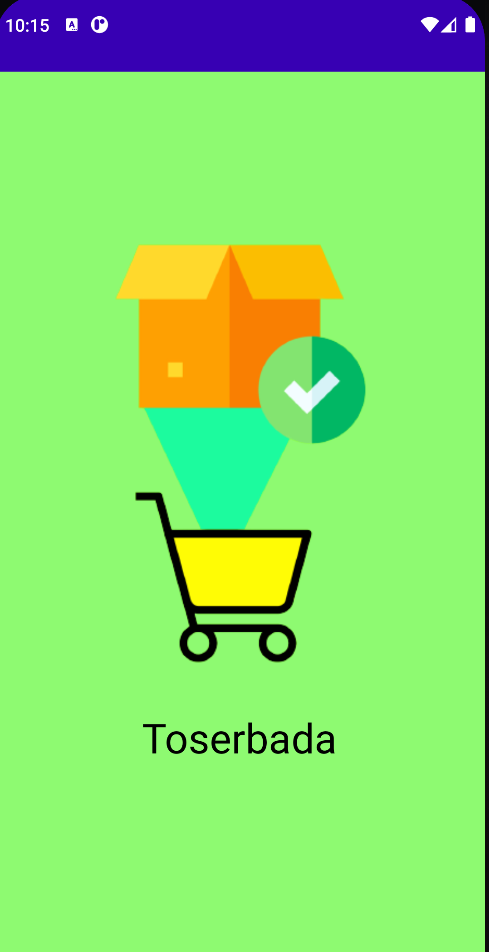

# TOSERBADA
berikut merupakan salah satu contoh aplikasi buatan saya pada mata pelajaran pemrogaman perangkat bergerak pada semester 3 menggunakan bahasa pemrogaman java, yang mana aplikasi ini berguna untuk menemukan referensi obat alternatif yang berguna untuk penyakit tertentu dan juga di aplikai ini juga terdapat sejarah singkat Indonesia

